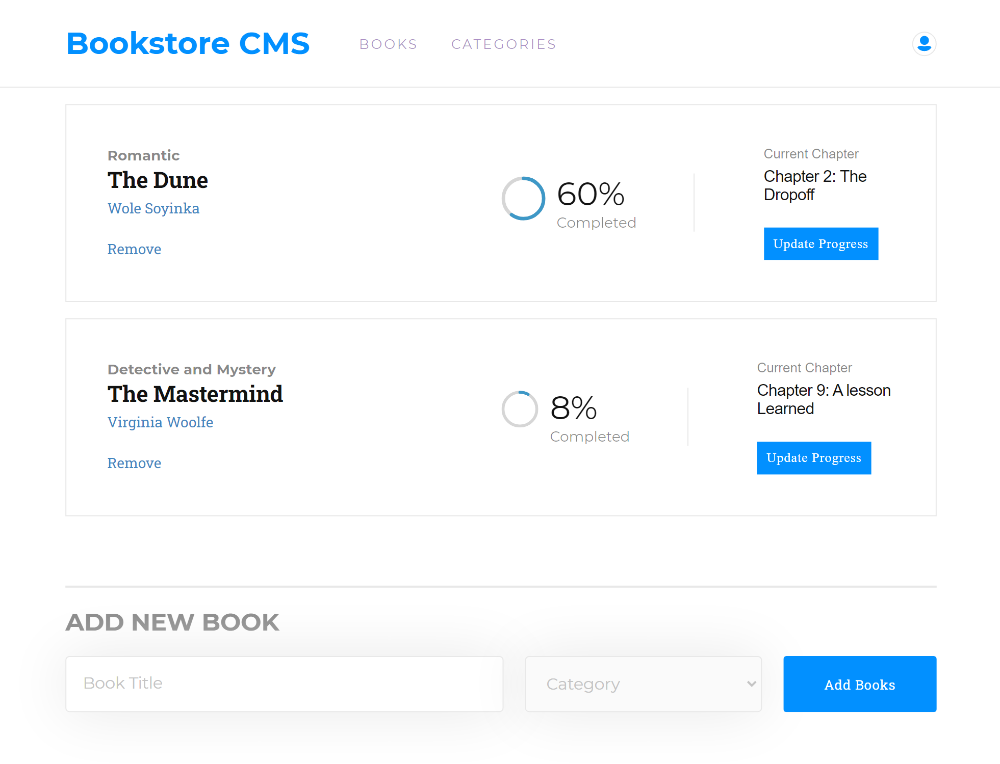

# Book Store
This project was bootstrapped with [Create React App](https://github.com/facebook/create-react-app) and Redux.


> This is an App that allows users to store names of books and their categories in a `Redux Store` as well delete books from the store.

## Screenshot


> 

This **Single Page App**  was built with **React-Redux**. The main page has links to:
- Books Page (Home Page) and 
- Categories Page (irrelevant for the project milestone)

When users input a `Book Title` and select a `Category`, the data is sent to this [Book API](https://www.notion.so/Bookstore-API-51ea269061f849118c65c0a53e88a739) and `onPageLoad`, the data in the API is fectched and stored in a **Redux Store**.

The `Redux Store` is accessible to all components and the data in the store (_state_) can be `retrieved`, `added` to, and `deleted` when **Actions** are dispatched to the store using React-Redux `Hooks`.

The _Authors_, _percentage completed_ and _Chapters_ are generated using a `Math.random()` method. The data gotten from the random selection is concatenated to a body parameter that goes to the API and on retrieval, they are `destructured` and displayed in the **ReactDOM**.

## Built With

- ### Major languages
  - Javascript, CSS, and HTML
- ### Frameworks
  - ReactJS, Redux, React-Redux
- ### Technologies used
  - Webpack, Babelrc, Linters

## Live Demo Links

🔗 [BookStore](gambit142-bookstore.netlify.app)

## Getting Started

To get a local copy up and running follow these simple example steps.

```
git clone https://github.com/Gambit142/Bookstore-App.git
```

and then run

```
npm i
npm start
```

## Installation

to build a production version to `bulid` folder run

```
npm run build
```

## Authors

👨🏿 **Francis Ugorji**

- GitHub: [@Gambit142](https://github.com/Gambit142)
- LinkedIn: [Francis Ugorji](https://www.linkedin.com/in/francis-ugorji-a567b7168/)


## 🤝 Contributing

Contributions, issues, and feature requests are welcome!

Feel free to check the [issues page](https://github.com/Gambit142/Bookstore-App/issues).

## Show your support

Give a ⭐️ if you like this project!

## Acknowledgments

- Hat tip to Microverse for the opprotunity to learn ReactJS and React_Redux using their platform
- The [Bookstore API](https://www.notion.so/Bookstore-API-51ea269061f849118c65c0a53e88a739) was used to store data gotten from the form controls
- [Zeplin](https://app.zeplin.io/project/5b35a9e13227086040f8eb75/screen/5b695e29bb8c844f118f9378) for the design used in the project
